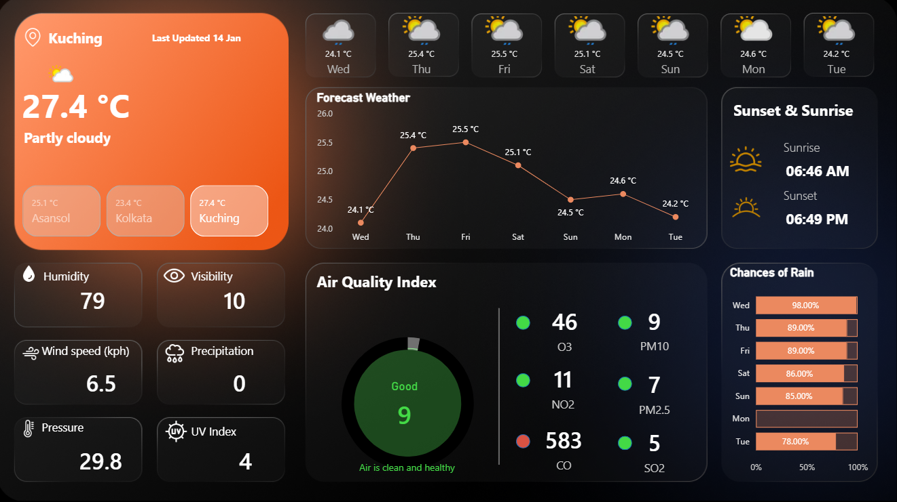

# 🌦 Weather & Air Quality Dashboard (Power BI)

## 📌 Project Overview

This project is an interactive Weather & Air Quality Dashboard built using Microsoft Power BI with live data fetched from a Weather API.
The dashboard provides real-time and forecasted insights on weather conditions, air quality, and environmental indicators for multiple cities.

### The primary goal of this project was to practice:

-	API-based data ingestion
-	Data modeling in Power BI
-	DAX-driven conditional formatting
-	Building a clean, information-rich dashboard
________________________________________
## 🎯 Objectives

-	Visualize current weather conditions for multiple cities
-	Analyze short-term weather forecasts 
-	Monitor Air Quality Index (AQI) and pollutants
-	Provide health-based AQI status and suggestions
-	Build a scalable data model using a master table approach
________________________________________
## 🛠 Tools & Technologies

-	Microsoft Power BI
-	Weather API – As data source (website link : https://www.weatherapi.com/ )
-	Power Query – API data transformation
-	DAX – Measures, conditional logic, and indicators
-	Data Modeling – Fact-style master table design
________________________________________
## 🗂 Data Architecture & Modeling

### 🔹 Step 1: API Data Ingestion

-	Weather API returns data for one city per API call
-	The base query was duplicated
-	City name was changed at the source level to fetch data for three different cities

### 🔹 Step 2: Master Table Creation

-	All city-level tables were merged into a single table named:
master table

This ensured:

-	Centralized data control
-	Easy scalability for adding more cities

### 🔹 Step 3: Logical Table Separation

Using the master table as reference, three analytical tables were created:

-	current → Current weather & AQI data
-	forecast_day → Daily weather forecast
-	forecast_hours → Hourly weather forecast

This separation improves:

-	Model clarity
-	Measure performance
-	Visualization flexibility
________________________________________
## 📊 Dashboard Features

### 🌡 Current Weather
  
-	Temperature
-	Weather condition (e.g., partly cloudy)
-	Humidity
-	Visibility
-	Wind speed
-	Precipitation
-	Pressure
-	UV Index

### 📅 Forecast Analysis
  
-	7-day temperature trend (line chart)
-	Daily weather cards with icons

### 🌅 Sunrise & Sunset
  
-	Daily sunrise and sunset timings per city

### 🌧 Chance of Rain
  
-	Day-wise probability of rain (%)
________________________________________
## 🌫 Air Quality Index (AQI) Analysis

### Pollutants Tracked
  
-	PM2.5
-	PM10
-	CO
-	NO₂
-	SO₂
-	O₃

### AQI Indicator
  
-	Dynamic AQI gauge
-	Color-coded severity levels
-	Health-based status and suggestions
________________________________________
## 🧠 DAX Measures (Key Logic)

### 🎨 AQI Color Indicator (Example: PM10)

```
PM10 Color = 

VAR AQI =
    ROUND(
        SELECTEDVALUE ( 'current'[current.air_quality.pm10] ),
        0
    )
RETURN
SWITCH (
    TRUE (),
    AQI <= 50,  "#43d946", -- Good
    AQI <= 100, "#fff570", -- Moderate
    AQI <= 150, "#ff9800", -- Poor
    AQI <= 200, "#d99343", -- Unhealthy
    AQI <= 300, "#ff5b0f", -- Severe
    "#d95243"              -- Hazardous
)
```

________________________________________
### 💡 AQI Health Suggestion

```
AQI Suggestion = 

VAR AQI = ROUND(SELECTEDVALUE('current'[current.air_quality.pm10]),0)
RETURN
SWITCH(
    TRUE(),
    AQI <= 50, "Air is clean and healthy",
    AQI <= 100, "Acceptable air quality, stay active",
    AQI <= 150, "Sensitive groups should reduce outdoor time",
    AQI <= 200, "Limit prolonged outdoor exertion",
    AQI <= 300, "Avoid outdoor activity if possible",
    "Stay indoors, wear a mask if outside"
)
```
________________________________________
### 📌 AQI Status

```
AQI Status = 

VAR AQI = ROUND(SELECTEDVALUE('current'[current.air_quality.pm10]),0)
RETURN
SWITCH(
    TRUE(),
    AQI <= 50, "Good",
    AQI <= 100, "Moderate",
    AQI <= 150, "Unhealthy for Sensitive",
    AQI <= 200, "Unhealthy",
    AQI <= 300, "Very Unhealthy",
    "Hazardous"
)
```
________________________________________
## 📈 Key Learnings

-	Handling API-based data in Power BI
-	Designing a master table architecture
-	Creating reusable analytical tables
-	Writing DAX for conditional formatting and business logic
-	Translating numeric AQI values into human-readable insights
-	Dashboard storytelling with environmental data
________________________________________
## 🧮 Dashboard Overview

  This view shows the overall weather summary with key KPIs and city-wise metrics.
  
________________________________________
## 🚀 How to Use

1.	Download the .pbix file
2.	Open in Power BI Desktop
3.	Refresh data (API key required if not embedded)
4.	Interact with visuals and city selectors
________________________________________
## 🔮 Future Enhancements

-	Add automatic city selection via slicer
-	Integrate historical weather trends
-	Improve AQI weighting using standard AQI formula
-	Deploy dashboard using Power BI Service
________________________________________
## 🙌 Acknowledgement

This project was developed as part of my learning process by following a Power BI tutorial by **The Developer**  
( https://www.youtube.com/watch?v=P8HB8dMfKNc ).

The dashboard was recreated independently by me with a focus on understanding the data modeling approach, DAX logic, and overall dashboard design.

________________________________________
👤 Author

Bikram Sadhu

🔗 LinkedIn: (https://www.linkedin.com/in/bikram-sadhu-9769b2284/)
________________________________________
⭐ Feedback

Suggestions and improvements are welcome.

This project is part of my continuous learning journey in Data Analytics.


